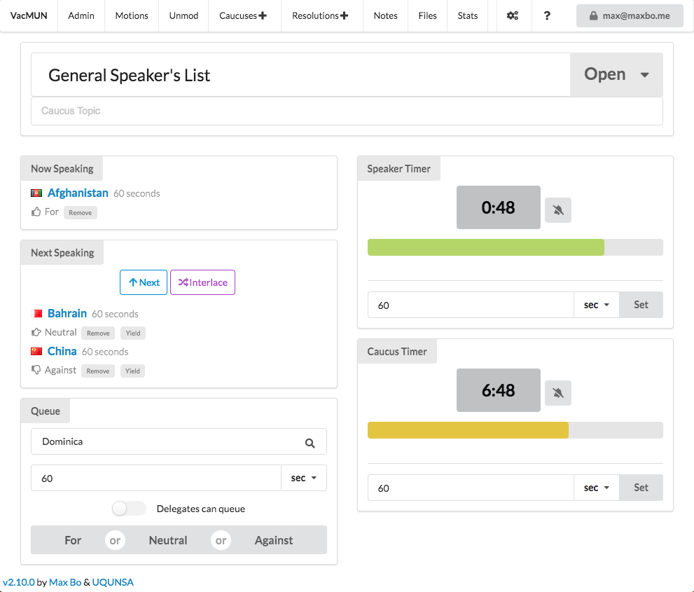

# Muncoordinated

[](https://github.com/RichardLitt/standard-readme)

Muncoordinated is a Model UN committee management service, (re)written with TypeScript, React, Semantic UI and Firebase, and available at [muncoordinated.io](https://muncoordinated.io).




## Building


```sh
yarn && yarn start
```

## Tests


```sh
yarn test && yarn run cypress
```


## Maintainers

[@MaxwellBo](https://github.com/MaxwellBo).

## Contributing

Feel free to dive in! [Open an issue](https://github.com/MaxwellBo/Muncoordinated-2/issues/new) or submit PRs.

Muncoordinated follows the [Contributor Covenant](http://contributor-covenant.org/version/1/3/0/) Code of Conduct.

### Contributors

This project exists thanks to all the people who contribute. Special thanks to:

- [UQ United Nations Student Association](https://www.facebook.com/UQUNSA/)


## License

[GNU AGPLv3](LICENSE) © Maxwell Bo
